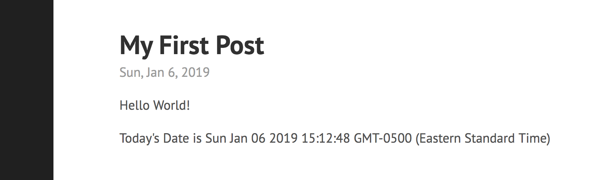

+++
categories = ["web"]
date = "2019-01-06T00:11:24-07:00"
description =  "This is a complete guide to the perfect blog setup using Hugo, Webpack 4 and Babel 7"
tags = ["hugo", "webpack", "javascript", "babel", "gulp"]
title = "The Perfect Blog Setup with Hugo, Webpack 4 and Babel 7 in 2019"

+++

Why live in the past when you can live on the EDGE! This is a complete guide to the perfect blog setup using Hugo, Webpack and Babel. As of January 2019, the latest versions are Hugo v0.53, Babel v7.2.5 and Webpack v4.28.3
<!--more-->

I already talked about the reason I choose Hugo in the previous [blog post](/post/hello-hugo/). Hugo is indeed hands down one of the best static HTML generators, but what do we do about the JavasSript part of the website? Embeding scripts directly kinda works but what about ES6, modules, async/await and other amazing new features. The best solution is of couse babel and webpack. Integrating Webpack and Babel into Hugo adds maximum expressibility into your blog without lossing any simplicities from using a static site generator. With this setup, you will get browser hot-reload for both html and JavaScript on file change! This guide will assume you have `hugo`, `node` and `yarn` already installed. We will focus on the integration of webpack with hugo, for more custom configurations you can visit their officail websites.

## Part One: Hugo

Setting up Hugo is perhaps the easist part of the guide. We will use `testblog` as the name of our blog, you should substitute the name as needed.

```bash
hugo new site testblog
cd testblog
git init
git submodule add https://github.com/spf13/hyde.git themes/hyde;
hugo new posts/my-first-post.md
echo 'Hello World!' >> content/posts/my-first-post.md
```

```toml
# ./config.toml
baseURL = "/"
languageCode = "en-us"
title = "My New Hugo Site"
theme = "hyde"
```

Note: baseURL `/` is very important because hugo tries to replace all links with fixed baseUrl like `https://zihao.mefavicon.png` which in my opinion is very lame because it only works when you are loading the site from the same domain. By setting it to `/`, the static files will work everywhere regardless of domain name.

```
hugo server -D
```

Yay we have our blog live and running, amazing start.


## Part Two: Webpack + Babel

Now we need to initialize our site as a webpack project.

```bash
yarn init
yarn add -D @babel/core @babel/preset-env \
    @babel/register babel-loader \
    browser-sync webpack webpack-cli gulp gulp-cli
```

Some explination for the packages

- @babel/core - babel transpiler
- @babel/preset-env - sensible babel preset for latest JS features
- @babel/register - used to run *.babel.js
- babel-loader - used by webpack to transpile
- browser-sync - used for browser reload
- webpack - trusted webpacker
- webpack-cli - cli for webpack
- gulp - we use gulp to connect webpack, hugo and browser-sync
- gulp-cli - cli for gulp

Now it's time to add some javascript

```javascript
// ./app/first-post.js
const date = new Date();
const div = document.createElement('div');
div.innerHTML = `<p> Today's Date is ${date} </p>`
document.getElementsByClassName("post").appendChild(div);
```
This script simply adds todays date to the end of the post. Let's now compile this with webpack and babel.

```javascript
// ./.babelrc
{
  "presets": ["@babel/preset-env"]
}
```

```javascript
// ./webpack.config.babel.js
import path from "path";

export default {
  entry: {
    firstpost: ["./app/first-post.js"],
    // js bundle for other posts, e.g.
    // secondpost: ["./app/second-post.js"]
  },
  output: {
    path: path.resolve(__dirname, "static", "js"),
    filename: "[name].bundle.js"
  },
  module: {
    rules: [
      {
        test: /\.js$/,
        use: ['babel-loader'],
        exclude: /node_modules/
      }
    ]
  }
};
```

```bash
yarn webpack --mode development
```

This simple config loads our javascript file, transpile it with babel-loader and then writes to the `static/js` folder.
We simply needs to add the output bundle into our post and then hugo will pick it up automatically.

```bash
echo '<script src="/js/firstpost.bundle.js"></script>' >> \
    ./content/posts/my-first-post.md
```



Amazing now we have ES6 integrated into our blog! The next step is getting it to reload automatically on file change.

## Part Three: Hook'em Up with Gulp

There are two ways to make auto-reload work. First is compile javascript file to `./static/js/*` and then have `hugo server` reload it, the other way is compile both javascript and html file to `./public/*` and reload them with browser-sync. I choose the second way because we can simply add `public` folder to gitignore and only check javascript source and html source into version control. With `static` folder, we can't distinguish between normal static js file and generated ones.

```javascript
// ./webpack.config.babel.js
...
export default {
  ...
  output: {
    path: path.resolve(__dirname, "public", "js"),
    filename: "[name].bundle.js"
  },
  ...
}

```

!!! Change webpack output from static to public

```javascript
// ./gulpfile.babel.js
import gulp from "gulp";
import cp from "child_process";
import BrowserSync from "browser-sync";

const browserSync = BrowserSync.create();
const webpackOptions = ["--colors", "--display-error-details"];
const hugoOptions = ["-v"];

gulp.task("build", gulp.parallel(
  () => runWebpack(["--mode", "production", "--profile"]),
  () => runHugo()
));

gulp.task("watch", () => {
  runWebpack(["--mode", "development", "--watch"]);
  runHugo(["--buildDrafts", "--buildFuture", "--watch"]);

  browserSync.init({
    server: {
      baseDir: "./public"
    }
  });
  gulp.watch("./public/**/*").on("change", browserSync.reload);
});

function runHugo(options) {
  return cp.spawn("hugo", hugoOptions.concat(options || []), {
    stdio: "inherit"
  });
}

function runWebpack(options) {
  return cp.spawn("yarn", ["webpack"].concat(webpackOptions, options || []), {
    stdio: "inherit"
  });
}
```

In this gulpfile we will define two tasks `build` and `watch`. `build` is used to generate production ready static files into the `public` folder while `watch` is used to run webpack and hugo in watch mode and output files to `public` folder. We also use gulp to watch the `public` foldeer with browserSync so the browser will hot reloaded on changes.

```javascript
// ./package.json
{
  ...
  "scripts": {
    "clean": "rm -rf public",
    "start": "gulp watch",
    "build": "gulp build"
  },
  ...
}
```

In the `package.json` we will define some entry points for convience. `yarn start` will start development server and `yarn build` will write production files to the public folder. You can then upload the production files to your website using your favourite deploy technologies.

```bash
# gitignore for our project
curl https://www.gitignore.io/api/node > .gitignore
sed -i '1s/^/public\/ \n/' .gitignore
```

```bash
yarn start # this opens the browser with hot-reload
```

Now the project is complete, you can start writing post and add some creative effects powered by javascript. Thanks for reading, now it's time to setup your very own amazing blog with Hugo, Webpack and Babel!

* * *

The complete code sample is availble on [GitHub](https://github.com/zzh8829/testblog)
