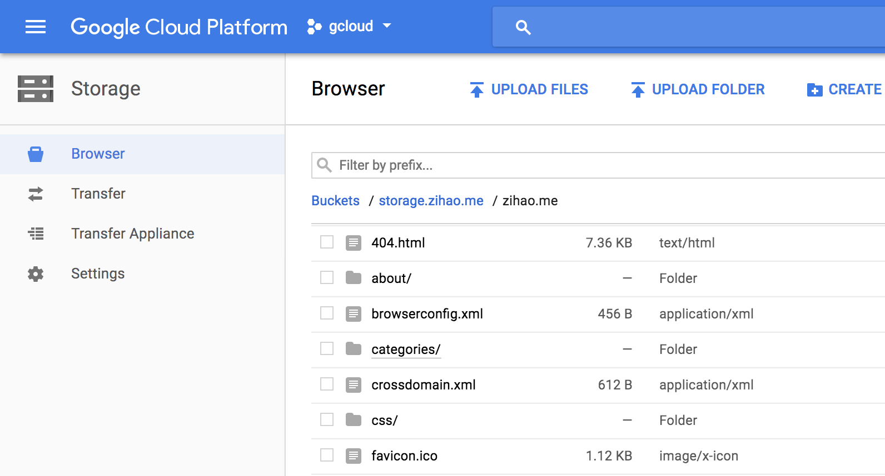
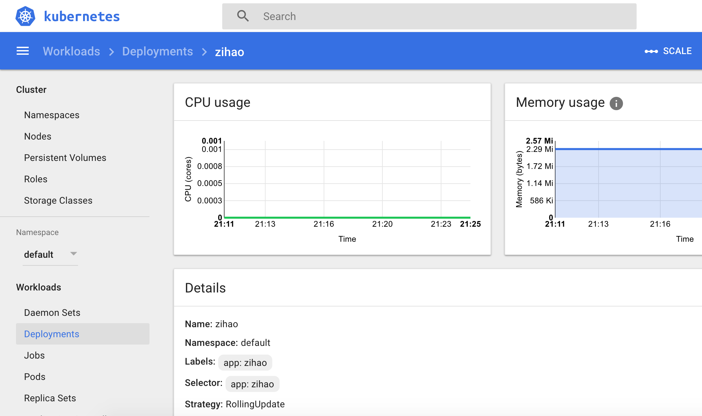

+++
categories = ["cloud"]
date = "2018-03-26T21:07:14-04:00"
description =  "Hosting a Static Website with Kubernetes and Google Cloud Storage"
tags = ["gke", "kubernetes", "nginx", "s3"]
title = "Hosting a Static Website with Kubernetes and Google Cloud Storage"

+++

As of March 2018, I finally finished upgrading my personal homepage to a modern and scalable cloud infrastructure. This website is hosted on the extremely reliable Google Cloud Storage proxied through my Kubernetes cluster.
<!--more-->

## The Road to Upgrade

Once upon a time, I hosted the first version of my website on a small no-name virtual private server (VPS). Later on, with the movement towards GitHub pages, I migrated my website there. As a part-time security researcher, I greatly value the necessity of HTTPS support, but GitHub pages never managed to add HTTPS for custom domains. Fortunately, the newly emerged competitor [GitLab](https://gitlab.com) satisfied all my requirements other than the downside of having to manually obtain a certificate and copy paste it there. My current Kubernetes + cloud storage solution brings the benefit of scalability and availability with cloud infrastructure at a very low cost.

## The Architecture


All client requests are load balanced through the Kubernetes ingress controller. The traffic will then go through nginx containers which proxy the data from Google Cloud Storage.

## Google Cloud Storage

In my example the main bucket that stores everything is call "storage.zihao.me" and my static files are uplaoded to the "zihao.me" folder under the bucket.



No other additional settings are required, we just need to remember the exact path of our static files.

## Nginx Proxy

The key configurations for proxying requests to Google Cloud Storage are listed here

```
recursive_error_pages on;

location / {
    include                /etc/nginx/nginx_gcs_proxy.conf;
    proxy_pass             https://storage.googleapis.com/storage.zihao.me/zihao.me$uri;
    error_page 404 = @index;
}

location @index {
    include                /etc/nginx/nginx_gcs_proxy.conf;
    proxy_pass             https://storage.googleapis.com/storage.zihao.me/zihao.me${uri}index.html;
    error_page 404 = @slash_index;
}

location @slash_index {
    include                /etc/nginx/nginx_gcs_proxy.conf;
    proxy_pass             https://storage.googleapis.com/storage.zihao.me/zihao.me${uri}/index.html;
    error_page 404 = /404.html;
}
```

Since Google Cloud Storage is just a simple file storage engine, we need to do some extra work to make URL access working. We setup a two level redirections so `folder/index.html`, `folder` and `folder/` all leads to the file at `folder/index.html`. The more common `index index.html` and `try_files $uri` settings do not work here since they were designed for local files only. The included [`nginx_gcs_proxy.conf`](https://github.com/zzh8829/zihao/blob/master/deploy/nginx_gcs_proxy.conf) sets correct proxy request headers and removes unnecessary response headers from Google Cloud Storage. The URL used in `proxy_pass` is `https://storage.googleapis.com/BUCKET/PATH$uri` as shown in the config. The exact configuration used for my file is available on my [GitHub Repository](https://github.com/zzh8829/zihao/blob/master/deploy/nginx_zihao.conf)

## Kubernetes

With Nginx proxy ready, we also need to set up the corresponding kubernetes deployment.



We can simply used the official lightweight Nginx docker image at `nginx:alpine`.

```yaml
containers:
- name: zihao
  image: nginx:alpine
  command: ["/bin/sh", "-c"]
  args:
    - "wget https://raw.githubusercontent.com/zzh8829/zihao/master/deploy/nginx_gcs_proxy.conf -O /etc/nginx/nginx_gcs_proxy.conf && \
      wget https://raw.githubusercontent.com/zzh8829/zihao/master/deploy/nginx_zihao.conf -O /etc/nginx/conf.d/default.conf && \
      nginx -g 'daemon off;'"
  ports:
  - containerPort: 8000
```

In the container configuration, we load the config file from GitHub and then fire up the nginx server. The Kubernetes service and ingress settings is very straightforward. I listed some selected parts of the configurations here.

```yaml
# service
ports:
- port: 80
  targetPort: 8000
---
# ingress
rules:
- host: zihao.me
  http:
    paths:
    - backend:
        serviceName: zihao
        servicePort: 80
      path: /
```

The complete Kubernetes setting is also available on my [GitHub Repository](https://github.com/zzh8829/zihao/blob/master/deploy/k8s.yaml). After all the hard work, simply deploy the image with `kubectl apply -f k8s.yaml` and congratulations: the website is online at https://zihao.me
