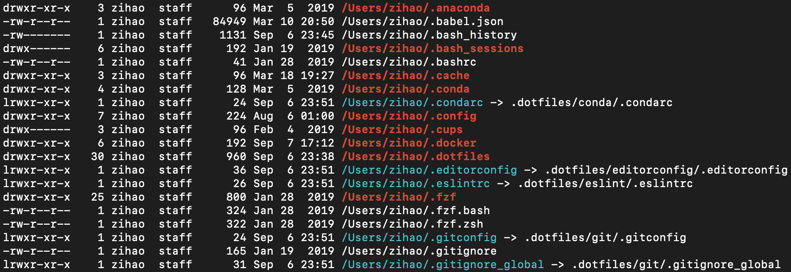

+++
title = "Managing Dotfiles with GNU Stow"
description = "Managing Dotfiles with GNU Stow, symlink, no folding, resolve stow conflict"
tags = ["devops", "dotfiles"]
categories = ["devops"]
date = 2019-09-07T20:25:43-07:00
+++

[GNU Stow](https://www.gnu.org/software/stow/) is an amazing application that
streamlines the management of unix config files aka dotfiles. Last week, I
converted my original `rsync` based dotfiles script to GNU Stow and could not be happier with the results.
<!--more-->

**TLDR**: [My dotfiles on GitHub](https://github.com/zzh8829/dotfiles)


<a style="background-color:black;color:white;text-decoration:none;padding:4px 6px;font-family:-apple-system, BlinkMacSystemFont, &quot;San Francisco&quot;, &quot;Helvetica Neue&quot;, Helvetica, Ubuntu, Roboto, Noto, &quot;Segoe UI&quot;, Arial, sans-serif;font-size:12px;font-weight:bold;line-height:1.2;display:inline-block;border-radius:3px" href="https://unsplash.com/@grohsfabian?utm_medium=referral&amp;utm_campaign=photographer-credit&amp;utm_content=creditBadge" target="_blank" rel="noopener noreferrer" title="Download free do whatever you want high-resolution photos from Fabian Grohs"><span style="display:inline-block;padding:2px 3px"><svg xmlns="http://www.w3.org/2000/svg" style="height:12px;width:auto;position:relative;vertical-align:middle;top:-2px;fill:white" viewBox="0 0 32 32"><title>unsplash-logo</title><path d="M10 9V0h12v9H10zm12 5h10v18H0V14h10v9h12v-9z"></path></svg></span><span style="display:inline-block;padding:2px 3px">Photo by Fabian Grohs</span></a>

## Dotfiles

Modern DevOps is all about automation and reproducibility. This philosophy is
the foundation of cloud infrastructure and should also be part of your daily
workflow. The [dotfiles](https://dotfiles.github.io) page on github said it
perfectly:

> **Backup**, **restore**, and **sync** the prefs and settings for your toolbox.
> Your dotfiles might be the most important files on your machine.

## GNU Stow

GNU Stow introduced many upgrades over traditional bash script based dotfiles scripts.

- symlink based installation which means you can modify config in home directory
- config files are split into separated package per application
- useful features including verbose mode and dry run
- high quality software maintained by GNU foundation

For each application you want to stow, simply create a folder containing the
config files like this

```text
.dotfiles/
    vim/
        .vimrc
    zsh/
        .zshrc
```

After installing GNU Stow with your favorite package manager, you can simply run this to symlink your dotfiles.
```bash
stow vim zsh
```




## No Folding

By default, GNU Stow will symlink top level folders into home directory. That's ok for most applications, but it does cause some trouble when the application tries to write into the config folders. For example, when `VIM` writes temporary files to the `~/.vim` folder, they will contaminate our git repository. The solution to this is using the no-folding option. No-folding will create all directory with `mkdir` and only symlink the config files. This is the stow command I use to to map configs.

```bash
for PKG in ${PACKAGES[@]}; do
	stow --no-folding --verbose $PKG
done
```

## Conflict Resolution

GNU Stow did not provide a built-in way to resolve conflicts. This is usually not a problem after configs are installed, but it is tricky for first time users. Here is a simple conflict resolution script modified from [mafrosis's repo](https://github.com/mafrosis/dotfiles/blob/master/install.sh)

```bash
PACKAGES=(
	conda
	tmux
	vim
	zsh
    # ...
)

for PKG in ${PACKAGES[@]}; do
	CONFLICTS=$(stow --no --verbose $PKG 2>&1 | awk '/\* existing target is/ {print $NF}')
	for filename in ${CONFLICTS[@]}; do
		if [[ -f $HOME/$filename || -L $HOME/$filename ]]; then
			echo "DELETE: $filename"
			rm -f "$HOME/$filename"
		fi
	done
done
```

You can find my personal [dotfiles setup on github here](https://github.com/zzh8829/dotfiles)
