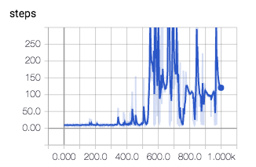

+++
date = "2017-08-03T18:00:46-04:00"
description =  "Solving CartPole with Deep Q Network"
tags = ["machine learning", "openai", "artificial intelligence", "reinforcement learning"]
title = "Solving CartPole with Deep Q Network"
categories = ["artificial intelligence"]
+++

CartPole is the classic game where you try to balance a pole by moving it horizontally. We will try to solve this with a reinforcement learning method called Deep Q Network.
<!--more-->


## Description

> A pole is attached by an un-actuated joint to a cart, which moves along a frictionless track. The system is controlled by applying a force of +1 or -1 to the cart. The pendulum starts upright, and the goal is to prevent it from falling over. A reward of +1 is provided for every timestep that the pole remains upright. The episode ends when the pole is more than 15 degrees from vertical, or the cart moves more than 2.4 units from the center.

The environment provides 4 observed states: horizontal location, horizontal speed, angle, and angular speed. The agent should takes in these 4 variables and output either left or right.

## Deep Q Network

```python
def q_network(input_state):
    h1 = tf.layers.dense(input_state, 10, tf.nn.relu, kernel_initializer=tf.truncated_normal_initializer(stddev=0.1))
    h2 = tf.layers.dense(h1, 10, tf.nn.relu, kernel_initializer=tf.truncated_normal_initializer(stddev=0.1))
    output = tf.layers.dense(h2, 2, kernel_initializer=tf.truncated_normal_initializer(stddev=0.1))
    return output

with tf.variable_scope('state_input'):
    state_in = tf.placeholder(tf.float32, [None, 4])

with tf.variable_scope('eval_weights'):
    q_value = q_network(state_in)

with tf.variable_scope('state_next_input'):
    state_next_in = tf.placeholder(tf.float32, [None, 4])

with tf.variable_scope('target_weights'):
    q_target = q_network(state_next_in)

weights = tf.get_collection(tf.GraphKeys.VARIABLES, 'eval_weights')
target_weights = tf.get_collection(tf.GraphKeys.VARIABLES, 'target_weights')
update_target_weight = [tf.assign(wt, w) for wt,w in zip(target_weights, weights)]

with tf.variable_scope('q_target_input'):
    q_target_in = tf.placeholder(tf.float32, [None, 2])

with tf.variable_scope('loss'):
    loss = tf.nn.l2_loss(q_target_in - q_value)

with tf.variable_scope('train'):
    train = tf.train.AdamOptimizer(learning_rate=0.001).minimize(loss)

tf_steps = tf.placeholder(tf.int32)
loss_smr = tf.summary.scalar('l2_loss', loss)
step_smr = tf.summary.scalar('steps', tf_steps)
```

## Result



We see that the network reached average of 200 steps per episode pretty quickly.

***

CartPole on OpenAI: https://gym.openai.com/envs/CartPole-v0


Deep Q Network: https://deepmind.com/research/dqn/
